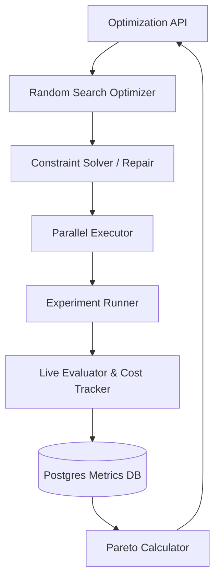

# RAGOS (formerly RagBench)

**The RAG Optimization Engine (AutoML for Retrieval-Augmented Generation)**

---

## 1. Executive Summary

RAGOS (Retrieval-Augmented Generation Operating System) is an extensible experimentation framework and optimization engine for RAG systems. It goes beyond static benchmarking. RAGOS acts as an **AutoML decision engine**, actively searching for and discovering the best RAG pipeline for a given dataset under explicit user constraints (e.g., budget, latency limits, local hardware requirements).

Instead of guessing whether to use a Cross-Encoder, Hybrid Search, or a larger Chunk Size, RAGOS evaluates the combinatorial search space and returns a multi-dimensional **Pareto Frontier** of the optimal pipelines.

---

## 2. Core Features (V2 Optimization Engine)

### 🚀 AutoML Optimization Loop
Submit declarative constraints (`latency <= 500ms`, `local_only = true`) and an objective (e.g., `maximize: faithfulness`). The engine automatically:
1. Mutates candidate configurations to repair constraint violations.
2. Explores the hyperparameter space (Chunk sizes, Retrieval strategies, Generator models).
3. Executes trials asynchronously in parallel.

### 📊 N-Dimensional Pareto Leaderboards
Instead of collapsing Quality, Speed, and Cost into a single arbitrary score, RAGOS computes a true **Pareto Frontier**. Visualize the exact trade-offs and choose the configuration that perfectly fits your production requirements (Fastest vs. Cheapest vs. Highest Quality).

### 🔌 Framework-Agnostic Plugin Architecture
RAGOS orchestrates experiments, not vendor lock-in. The core logic programs against abstract interfaces (`BaseRetriever`, `BaseGenerator`, etc.). You can easily drop new integrations into the `plugins/` directory without rewriting the engine.

### 💰 Automated Cost & Latency Tracking
Integrated with `litellm` to track exact token costs across providers, automatically zeroing out costs for local models (`phi3`, `mistral`, `llama3`).

---

## 3. High-Level Architecture

The architecture separates execution from orchestration and optimization.

---

## 4. Architecture Decision Records (ADRs)

Our engineering reasoning is documented. See the `docs/adr/` directory for insight into major architectural choices:
- `0001-random-search-over-grid-search.md`: Why we avoid combinatorial explosion.
- `0002-pareto-frontier-for-leaderboards.md`: Why single-score leaderboards are flawed.
- `0003-framework-agnostic-interfaces.md`: Why we avoid tight coupling to specific RAG frameworks.
- `0004-plugin-architecture-for-extensibility.md`: How the system scales via auto-discovery.

---

## 5. API Reference

| Method | Endpoint | Description |
|---|---|---|
| `POST` | `/datasets/upload` | Upload a query-ground_truth dataset for experimentation. |
| `POST` | `/experiments/` | Create a baseline experiment configuration. |
| `POST` | `/experiments/{id}/optimize` | Launch the AutoML optimizer on a baseline. |
| `POST` | `/experiments/leaderboard/pareto` | Retrieve the non-dominated set of optimal pipelines. |

---

## 6. Future Roadmap

**V3 (Intelligent Diagnosis)**
- `LLMJudgeAnalyzer`: Auto-generates explanatory reports detailing exactly *why* a pipeline failed (e.g., "Chunk 3 contradicts Answer Y").
- Extensible failure categorization.

**V4 (Adaptation)**
- Automated LoRA fine-tuning for domain adaptation when heuristic optimization hits a ceiling.
- Synthetic dataset generation.

---

## License
MIT
