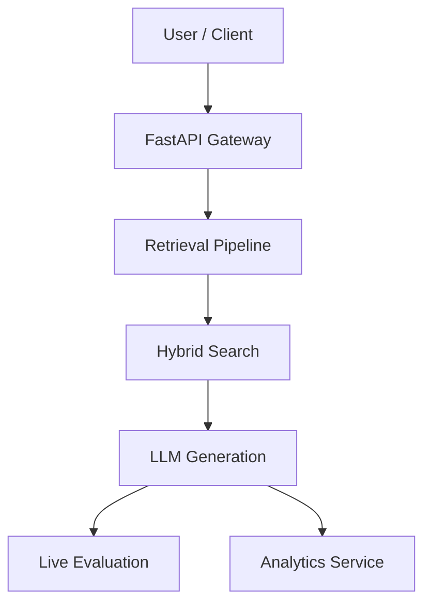
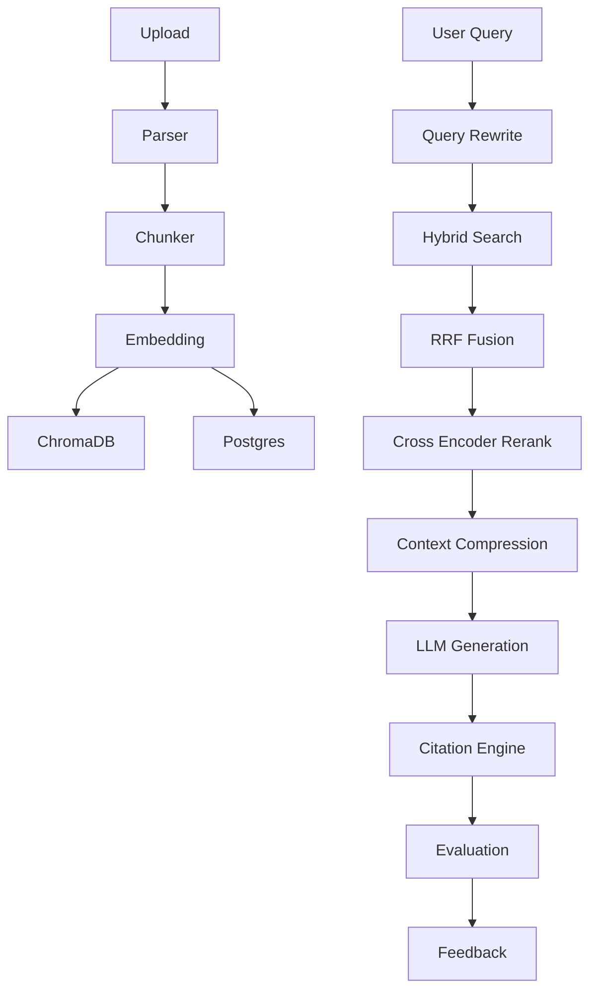

# Production Retrieval Platform

**Enterprise-Grade Document Search and Information Retrieval System**

[](https://python.org)
[](https://fastapi.tiangolo.com)
[](https://postgresql.org)
[](https://trychroma.com)
[](https://docker.com)
[](LICENSE)

---

## 1. Executive Summary

The Production Retrieval Platform enables enterprise-grade document search by combining hybrid retrieval, query rewriting, reranking, context compression, citation grounding, and continuous evaluation.

Unlike traditional RAG applications that simply embed and retrieve, this system continuously measures retrieval quality, strictly controls context budgets, grounds all generated answers to explicit source citations, and remains extensible across a multitude of document types.

---

## 2. System Requirements & Guarantees

### Functional Capabilities
- **Multi-Format Ingestion**: Parsers for PDF, DOCX, Markdown, Websites, and GitHub repositories.
- **Advanced Search**: Hybrid search utilizing both dense embeddings and sparse (BM25) matching.
- **Retrieval Optimization**: Query rewriting, cross-encoder reranking, and extractive context compression.
- **Continuous Evaluation**: Sampled, asynchronous live-traffic scoring for quality metrics.
- **Feedback & Analytics**: Integrated user feedback loops and metrics aggregation.

### Retrieval Contracts (System Invariants)
- **Traceability**: Every query, generation, and evaluation is fully traceable via UUIDs.
- **Citation Grounding**: Every generated citation physically maps back to a retrieved source chunk.
- **Budget Enforcement**: No retrieved context ever exceeds the configured LLM token limit.
- **Data Immutability**: User feedback never modifies source data or indices directly.

---

## 3. High-Level Architecture

The architecture separates concerns into specialized layers, avoiding the monolithic "chain" approach common in simple RAG tutorials.



---

## 4. End-to-End Pipeline

This represents the core data and request flow for ingestion and retrieval.



---

## 5. Architectural Deep Dives

### Parser Registry
The ingestion system follows the Open/Closed Principle. Adding a new file type only requires creating a class that implements the `DocumentParser` interface. Chunking strategies are tightly coupled to the parser format to ensure semantic boundaries are respected:
- **PDF**: Token-based Chunker (fixed size with overlap).
- **Markdown**: Heading Chunker.
- **GitHub**: AST / Function Chunker.
- **Website**: DOM Chunker.

### Hybrid Retrieval & RRF
Queries are fanned out concurrently to both Dense (Vector) and Sparse (BM25) indices.
The results are merged using Reciprocal Rank Fusion (RRF):
`RRF_score(d) = Σ_i 1 / (k + rank_i(d))`
We use RRF instead of weighted averaging because it elegantly fuses scores from different spaces (unbounded BM25 vs. cosine distance) without requiring complex score calibration.

### Cross-Encoder Reranking
While Bi-Encoders are fast (pre-computed), they lack precision. Cross-Encoders jointly encode the query and document, leading to significantly higher relevance. Because they are computationally expensive `O(N)`, we filter down to a top-K candidate list via the Bi-Encoder, and only apply the Cross-Encoder to the shortlist.

### Context Compression
We utilize an **Extractive-First** compression algorithm. It scores sentences within the retrieved chunks and selects only the highest-value sentences until the exact token budget is reached. This is deterministic, extremely fast, and avoids the high latency of invoking a summarization LLM.

### Citation Engine
LLMs hallucinate citations if asked to self-report. We employ a post-hoc grounding system.
1. The generated answer is split into sentences.
2. Each sentence is embedded and compared against the embeddings of the retrieved chunks.
3. Citations are strictly grounded if the cosine similarity exceeds `0.75`.

---

## 6. Evaluation Metrics

To ensure the system improves empirically, a sampled percentage of live queries undergo automated evaluation without blocking the client response:
- **Faithfulness**: Is the answer derived solely from the provided context?
- **Context Precision**: Were the highly ranked chunks actually relevant to the query?
- **Context Recall**: Did the retrieved chunks cover all elements needed to answer the query?
- **Answer Relevancy**: Does the generated answer directly address the user's prompt?

---

## 7. Storage Ownership

We utilize purpose-built data stores rather than forcing one database to do everything:
- **PostgreSQL**: Relational metadata, Queries, Evaluation Scores, User Feedback.
- **ChromaDB**: Dense vector embeddings and similarity search indices.
- **Redis (Optional)**: Semantic caching for bypassing retrieval on duplicate queries.

---

## 8. Failure Modes & Resilience

- **Embedding / LLM Failure**: Fallback to alternative local models or degrade gracefully.
- **Vector DB Outage**: Graceful fallback to Keyword (BM25) only.
- **Citation Failure (Threshold miss)**: Returns the answer without a citation (we strictly refuse to fabricate sources).
- **Evaluation Failure**: Fails open. Skips the evaluation and logs the error; the user's critical path is unaffected.

---

## 9. Local Setup & Execution

### Prerequisites
- Docker & Docker Compose
- Native `ollama` installation (if using local models for generation)

### Start Services
```bash
# Clone the repository
git clone https://github.com/VanshikaLud04/Rag-bench
cd Rag-bench

# Start the infrastructure (Postgres, ChromaDB, Redis, API)
docker compose up -d
```

### API Reference
| Method | Endpoint | Description |
|---|---|---|
| `POST` | `/ingest/` | Upload and ingest a document. |
| `POST` | `/query/stream` | Full retrieval pipeline with streaming SSE response. |
| `POST` | `/feedback/` | Submit user rating (+1/-1) for a query. |

---

## 10. Future Roadmap

**V2 (Upcoming)**
- Incremental indexing and document updates.
- Optical Character Recognition (OCR) integration.
- Image extraction and multimodal search capabilities.

**V3**
- Agentic retrieval and knowledge graph integration.
- Multi-hop document retrieval.
- Learned reranking architectures.

---

## License
MIT
